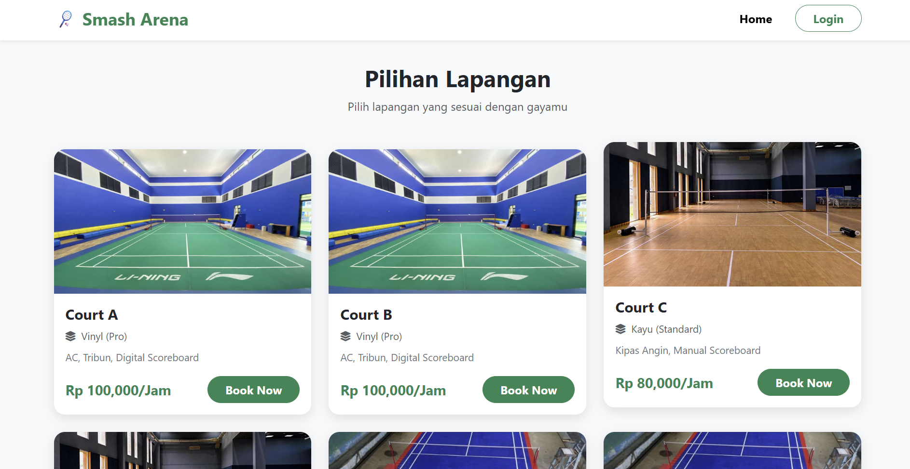
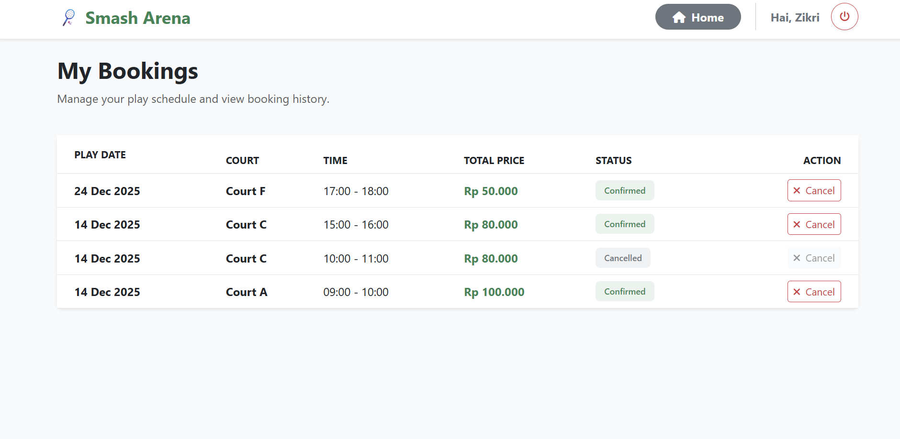
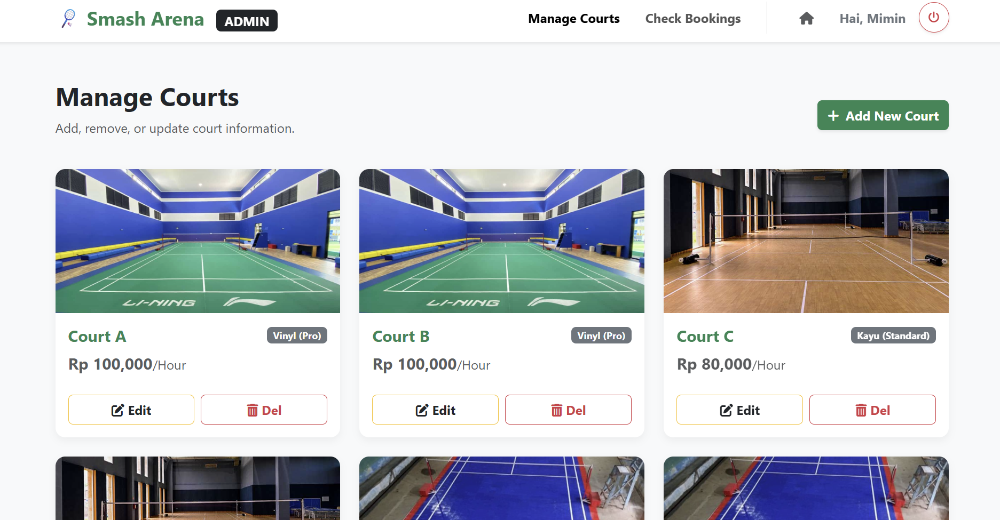
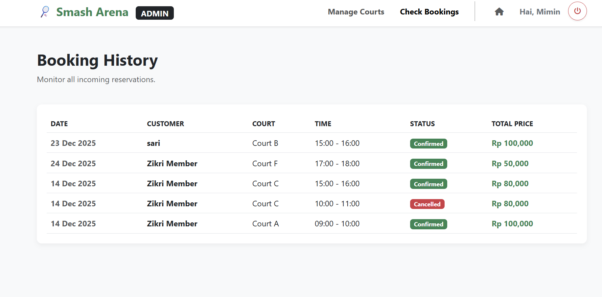

# 🏸 Smash Arena - Badminton Booking System

**Smash Arena** is a full-stack web application designed to simplify online badminton court reservations. This application connects users who want to play with real-time court availability, complete with a comprehensive admin panel for data management.

## 👥 The Team

- **Syah Amin Zikri** (5025241197)
- **Muhammad Cholaif Al Ghifari H** (5025241210)
- **Al Jad Kaukabudduri Hardianto** (5025241248)

---

## Key Features

### User Features

- **Authentication:** Secure account registration and login system.
- **Smart Availability Check:** The system automatically detects schedule conflicts. If a time slot is already booked, users are prevented from selecting it.
- **Court Booking:** Easily select play dates and time slots to reserve a court.
- **User Dashboard:** View personal booking history and current status (Confirmed/Cancelled).
- **Cancel Booking:** Capability to cancel reserved schedules.

### Admin Features

- **Court Management (CRUD):** Add, Edit, and Delete court information (Prices, Facilities, and Photos).
- **Booking Monitoring:** View a complete list of all incoming bookings from every user.
- **Admin Dashboard:** Quick and centralized access to all management menus.

---

## Tech Stack

### Frontend

- **HTML5 & CSS3:** Page structure and styling.
- **Bootstrap 5:** CSS Framework for responsive design and modern UI components.
- **JavaScript (Vanilla):** Handles interactive logic and API consumption (Fetch).
- **SweetAlert2:** Provides modern and aesthetic popup notifications.

### Backend

- **C# / .NET 8:** Primary programming language.
- **ASP.NET Core Web API:** Framework used to build the RESTful API.
- **Entity Framework Core:** Object-Relational Mapper (ORM) for database interaction.
- **MySQL:** Database used for storing Users, Courts, and Booking data.

---

## 📸 Screenshots

|             Halaman Utama              |            Detail & Booking             |
| :------------------------------------: | :-------------------------------------: |
|  |  |

|             Dashboard Admin              |             Booking Admin              |
| :--------------------------------------: | :-----------------------------------: |
|  |  |
